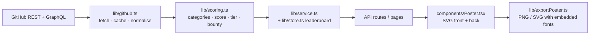

<div align="center">

# GITBOUNTY

### *Every coder has a bounty.*

Turn any **GitHub profile** or **repository** into a vintage One Piece-style **wanted poster**,
priced by a transparent, explainable scoring engine.


**[Live site](https://gitbount.vercel.app/)** · **[How it works](https://gitbount.vercel.app/how-it-works)**

</div>

---

## What it does

```
  @username  ──►  INVESTIGATION  ──►  SCORE  ──►  BOUNTY  ──►  WANTED POSTER
  owner/repo      (GitHub API)       (0–100)     (฿ 1M–3B)     (PNG / SVG)
```

Type a GitHub username or `owner/repo`. The server fetches real public data, scores it, converts the score into a bounty, and reveals a poster you can download, flip over to inspect, and share.

| | |
|---|---|
|  **Profile & repository bounties** | A person is a "wanted outlaw"; a project is "wanted: this project". |
|  **Cinematic reveal** | Six-stage investigation sequence, then a count-up from ฿1 to your final bounty. |
|  **Poster as an artifact** | Aged paper, ink, scrolls, crumple texture, drawn as **SVG in code** (no image AI), so text is always sharp. |
|  **What you see is what you download** | PNG (1600×2240) or SVG, with fonts embedded so the file matches the screen. |
|  **Flip / Inspect** | The back of the poster is a "Bounty Intelligence" report: category scores, stats, method. |
|  **Shareable pages** | `/bounty/<user>` and `/bounty/<owner>/<repo>` with Open Graph preview images. |
|  **The Bounty Board** | Leaderboard sorted by highest, recent, most active or repository bounty. |
|  **Day / night mode** | Parchment by day, nighttime pirate map by night. Respects reduced-motion. |

> **Important:** the bounty is a **gamified score**, not a measure of programming ability. Stars and followers are a weak proxy for skill, and the weights are opinionated and adjustable.

---

##  How the bounty is calculated

Everything lives in [`lib/scoring.ts`](lib/scoring.ts): pure, deterministic and covered by tests.

### 1. Diminishing returns

Raw numbers never score linearly. Every signal passes through a saturation curve:

```
sat(x, k) = 100 × (1 − e^(−x / k))
```

`k` is the value where a signal earns about **63%** of its points. So going from 0 to 400 stars matters far more than 4,000 to 4,400, and **100 low-impact repos cannot beat a few that matter**.

| Constant | Value | | Constant | Value |
|---|---|---|---|---|
| stars | 400 | | languages | 5 |
| forks | 120 | | releases | 15 |
| followers | 300 | | contributors | 30 |
| repos | 25 | | watchers | 150 |
| account age (years) | 6 | | | |

### 2. Five categories → one score

```
score = 0.20·Activity + 0.30·Impact + 0.15·Engineering + 0.20·Community + 0.15·Consistency
```

Each category is 0–100, so the final score is 0–100. Weights are in `SCORING_CONFIG` and easy to change.

**Profile mode**

| Category | Formula |
|---|---|
| **Activity** | With a token: `0.3·sat(recentRepos,6) + 0.1·sat(repos,25) + 0.6·sat(commits + 3·PRs + 2·reviews + issues, 900)` <br> Without: `0.6·sat(recentRepos,6) + 0.4·sat(repos,25)` |
| **Impact** | `0.7·sat(stars,400) + 0.3·sat(forks,120)` |
| **Engineering** | `0.4·sat(languages,5) + 0.6·hygiene·100` (hygiene = share of original repos that have a description **and** a license) |
| **Community** | With a token: `0.8·sat(followers,300) + 0.2·sat(reviews,60)` <br> Without: `sat(followers,300)` |
| **Consistency** | With a token: `0.4·sat(age,6) + 0.6·(activeWeeks/52·100)` <br> Without: `0.7·sat(age,6) + 0.3·sat(recentRepos,4)` |

*recentRepos* = original (non-fork) repos pushed in the last 180 days. Commit, PR, issue, review and weekly-activity data cover the **last year** and need a server `GITHUB_TOKEN` (GraphQL).
**Anti-spam:** profiles with more than 50 repos and fewer than 5 stars get their Activity multiplied by 0.6.

**Repository mode**

| Category | Formula |
|---|---|
| **Activity** | `sat(365 / (1 + daysSinceLastPush), 40)` |
| **Impact** | `0.7·sat(stars,1600) + 0.3·sat(forks,480)` (thresholds 4× higher than profiles) |
| **Engineering** | `0.3·sat(languages,4) + 0.3·sat(releases,15) + 0.4·hygiene·100` (hygiene = description, license, issues enabled, homepage) |
| **Community** | `0.6·sat(contributors,30) + 0.4·sat(watchers,300)` |
| **Consistency** | `sat(repoAgeYears, 4)` |

### 3. Score → bounty

```
bounty = 1,000,000 × 10^(0.035 × score)      (rounded to the nearest ฿1,000)
```

Every score point multiplies the bounty by about **1.084**, so bounties escalate the way real ones do.

| Score | 0 | 20 | 40 | 60 | 80 | 100 |
|---|---|---|---|---|---|---|
| **Bounty** | ฿1M | ฿5.0M | ฿25.1M | ฿125.9M | ฿631M | ฿3.16B |

### 4. Classes (tiers)

| Class | From score | | Class | From score |
|---|---|---|---|---|
| UNKNOWN | 0 | | CAPTAIN | 55 |
| ROOKIE | 12 | | SUPERNOVA | 70 |
| DECKHAND | 25 | | YONKO | 85 |
| RAIDER | 40 | | LEGENDARY | 95 |

Names, thresholds, colors and descriptions are in `TIERS` and can be swapped freely.

### 5. "Why this bounty?"

Each category's share of the final bounty is `bounty × (categoryScore × weight) / Σ(score × weight)`, so the contributions always add up to the total. They're shown on the result page and on the back of the poster.

---

##  Architecture



```
app/
  page.tsx                    landing + hunt flow
  bounty/[...slug]/page.tsx   shareable result pages (+ OG metadata)
  leaderboard/  how-it-works/
  api/bounty   api/og   api/health
components/                   Poster (front/back) · Result · Hunt · Board · Counter …
lib/
  github.ts      API access, validation, 10-min cache, 8 s timeout, error mapping
  scoring.ts     config, tiers, formulas        scoring.test.ts   unit tests
  metrics.ts     glyph widths from the bundled fonts (exact poster text fitting)
  store.ts       leaderboard: Upstash Redis in production, JSON file locally
  exportPoster.ts  SVG → PNG/SVG export
public/fonts/                 Playfair Display · Quicksand · Special Elite · Inter (self-hosted)
```

**Poster engine.** The poster is a deterministic SVG: parchment from SVG filters (`feTurbulence`, lighting), ink wobble from displacement maps, and text fitted using real glyph widths from the bundled fonts, so layout is identical in every renderer. Exporting embeds the fonts as data URIs, rasterizes at 1600×2240, and downloads exactly what is on screen.

---

##  Run locally

```bash
npm install
cp .env.example .env.local     # optional: add GITHUB_TOKEN
npm run dev                    # http://localhost:3000

npm test                       # scoring engine tests
npm run typecheck
```

### Environment variables

| Variable | Required | Purpose |
|---|---|---|
| `GITHUB_TOKEN` | Strongly recommended | Server-side only. Raises the GitHub limit from 60 to 5,000 requests/hour and enables commit/PR/issue/review/weekly-consistency signals. A **classic token with no scopes** is enough. |
| `NEXT_PUBLIC_SITE_URL` | For production | Absolute URL for Open Graph tags, e.g. `https://yourdomain.com`. |
| `UPSTASH_REDIS_REST_URL` `UPSTASH_REDIS_REST_TOKEN` | For a persistent leaderboard | Also accepts `KV_REST_API_URL` / `KV_REST_API_TOKEN`. If unset, a local JSON file is used. |
| `DATA_DIR` | No | Folder for the local JSON fallback (default `./.data`). |

Never commit `.env*` files (they're in `.gitignore`).

---

##  Deploy

### Vercel + Upstash (recommended)

1. Push the repo to GitHub and import it at [vercel.com](https://vercel.com).
2. In the project's **Storage** tab, add **Upstash → Redis** (free plan). Vercel injects the REST variables for you.
3. Under **Settings → Environment Variables**, add `GITHUB_TOKEN` and `NEXT_PUBLIC_SITE_URL`.
4. **Redeploy** (variables only apply to new deployments).
5. Visit `/api/health` to confirm: you should see `"backend":"redis","ok":true`.

### Docker / VPS / Railway / Fly / Render

```bash
docker build -t github-bounty .
docker run -p 3000:3000 -e GITHUB_TOKEN=... -v bounty-data:/data github-bounty
```

The volume keeps the leaderboard between restarts.

---

##  API

| Endpoint | Description |
|---|---|
| `GET /api/bounty?q=@user` or `?q=owner/repo` | Calculates and returns the full bounty result (JSON). Rate-limited to 12 requests/minute per IP. |
| `GET /api/og?q=…` | 1200×630 Open Graph card for a bounty. |
| `GET /api/health` | Which storage backend is active, whether the token is set. Never returns secrets. |

Errors are themed but clear: *"The trail has gone cold"* (not found), *"The Marines have blocked the route"* (GitHub rate limit), plus invalid input, timeout and upstream failures.

---

##  Security & reliability

- Tokens stay on the server and never reach the browser.
- User input is validated against GitHub's username/repo patterns before any request.
- GitHub calls have an 8 s timeout and a 10-minute in-memory cache.
- The leaderboard keeps the newest 500 entries; storage failures never break a bounty.
- Public data only, so private repositories can't be scored.

##  Known limitations

- **Scores depend on whether a token is set.** With a token the activity, community and consistency formulas use commit/PR data, so the same profile scores differently without one. Run with a token in production.
- Stars, forks and followers overlap (one popular repo can lift several categories). There is no combined popularity cap yet.
- Contributor count is read from a single page (max 100), so large projects top out at 100.
- The per-IP rate limiter is in memory, so it is per server instance on serverless hosts.
- Profile stats cover public, original (non-fork) repos among the 100 most recently pushed.

##  Ideas

Popularity cap on overlapping signals · separate weights per mode · poster themes by tier · true per-signal "why" breakdown on the back · persistent rate limiting.

---

<div align="center">

*Built for developers who leave a trail.* 🏴‍☠️

</div>